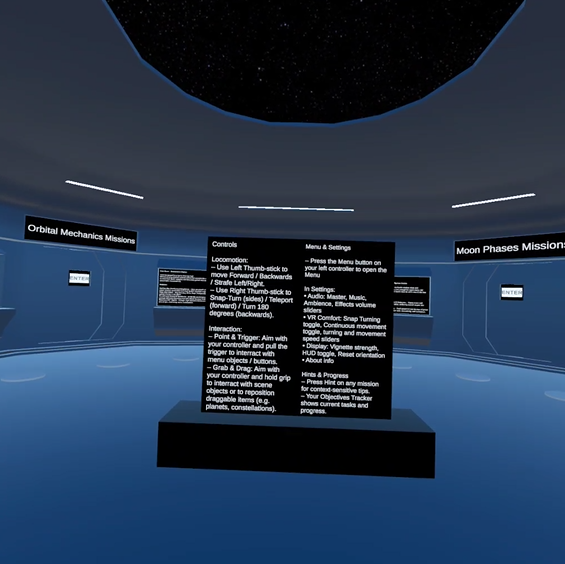

# Solaris Adventure  
**Educational VR Game — Gameplay Systems & Interaction Design (Unity / C#)**

Solaris Adventure is an educational VR game developed as part of my Bachelor’s thesis, with a strong focus on **gameplay systems, interaction consistency, and VR usability**.  
It teaches middle-school astronomy concepts (grades 5–8) through **interactive VR missions** and **free exploration**.

> **Note:** The full Unity project and playable builds are not publicly available. Additional details can be shared on request.

---

## What This Project Demonstrates
- Designing gameplay systems under **VR usability/comfort constraints**
- Building **reusable interaction logic** across multiple gameplay contexts
- Structuring a multi-scene project with clear **system responsibilities**
- Implementing a **cross-cutting localization system** in an existing codebase

---

## Key Systems Overview

| System | What it does | Why it matters |
|---|---|---|
| Mission flow & progression | Controls mission state, objectives, and completion feedback | Keeps gameplay logic structured and scalable |
| VR interaction layer | Handles consistent object interaction across missions | Reduces duplicated scene logic and improves UX consistency |
| UI & feedback | Presents instructions, progress, and contextual info in VR | Prevents overload and improves clarity for younger players |
| Content/data representation | Structures learning content and mission data | Enables iteration without rewriting core mechanics |
| **Localization (post-thesis)** | Full LT localization + runtime language switching in settings | Demonstrates cross-cutting refactor + real-world readiness |
| Audio & polish systems | Ambient/interaction SFX and scene cohesion | Improves readability and “finished” feel |

---

## Project Structure
The game follows a **hub-and-missions structure**:
- Main hub (navigation and progression)
- Missions:
  - Solar System
  - Orbital Mechanics
  - Moon Phases
  - Constellations
- Free-roam exploration mode

---

## Implementation Notes (for technical review)

This section highlights representative systems and implementation choices.  
(Full Unity project is private; code details can be shared on request.)

### Representative Systems & Scripts

**Mission flow orchestration**
- `MissionSceneController` — mission state, progression flow, completion conditions, and UI state coordination.
- Mission-specific controllers (e.g., `SolarSystemLevel*Controller`, `OrbitalMechanicsLevel*Controller`, `MoonPhasesLevel*Controller`, `ConstellationLevel*Controller`) — rules and objectives per mission, kept separate to avoid “one giant controller” logic.

**Reusable VR interaction layer**
- `GenericInteractable` — shared interaction baseline used across mission contexts.
- `GenericDragInteractable` — drag-driven interaction building block used for multiple mission mechanics.
- (Where needed) specialized interactables extend the same interaction language rather than introducing new, inconsistent rules.

**UI & settings as gameplay systems (VR-aware)**
- `PersistentUI` — keeps core UI available across contexts without duplicating per-scene UI logic.
- `UIFollowController` — VR-friendly UI placement behaviour (readability and comfort considerations).
- `GlobalMenuManager` + `SettingsManager` — centralized navigation/menu flow and settings application.

**Data-driven learning content**
- `FactData` + `FactObject` — structured content representation, enabling iteration on learning material without rewriting core mission logic.
- (Constellations) puzzle/trivia data is represented in dedicated data assets rather than being hard-coded into mission scripts.

**Audio & cohesion**
- `AudioManager` — centralized audio control; supports consistent feedback and atmosphere across scenes.

**XR initialization glue**
- `XRTrackingOriginBootstrap` — runtime setup/consistency handling for XR tracking origin behaviour.

---

### Localization System (post-thesis, cross-cutting change)

After the thesis defense, I implemented full localization using Unity’s Localization workflow:

- Two locales: **English (en-US)** and **Lithuanian (lt-LT)**
- Multiple **String Tables** split by context (main scene, missions, trivia, free-roam/info zones, etc.)
- **Runtime language switching** via settings menu (updates UI text without restarting)

This feature required touching UI/text surfaces across missions and ensuring updates are safe and consistent in active scenes (a cross-cutting refactor rather than isolated changes).

---

## My Role
Solo development, including:
- VR interaction and control systems
- Gameplay logic and mission flow
- Scene structure and navigation
- UI flow and player feedback
- Localization system (post-thesis)

This project was developed end-to-end, including post-delivery system refactoring and feature expansion.

---

## Technology
- Unity (VR)
- C#
- Custom gameplay & interaction systems
- XR interaction systems

---

## Media
Gameplay short: https://youtube.com/shorts/7OgnFOWju9Q?feature=share

---

## Screenshots
  
  

More screenshots are available in the `images` folder.
